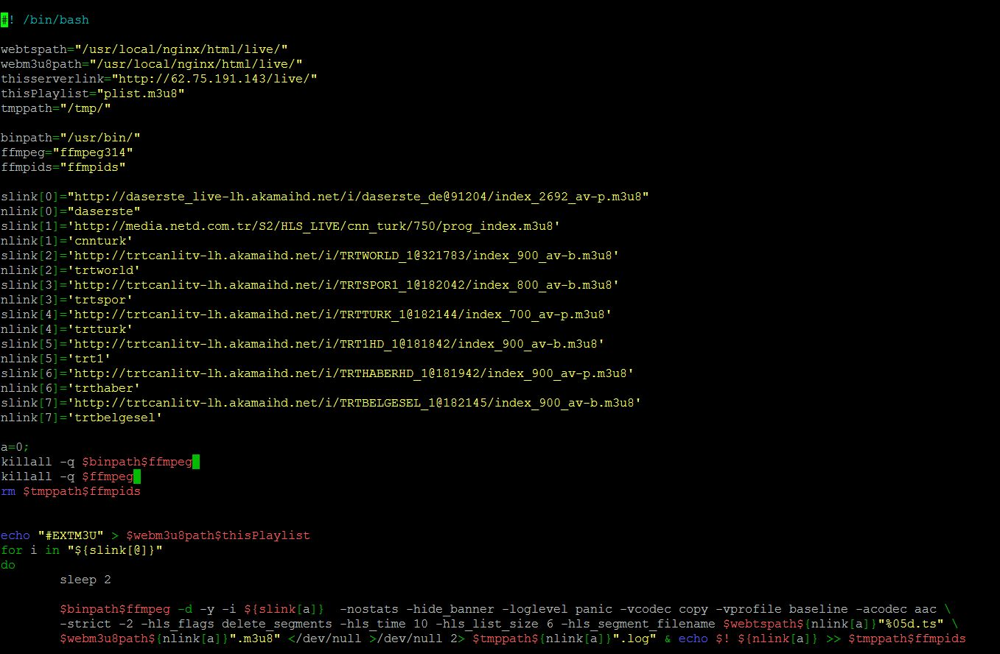
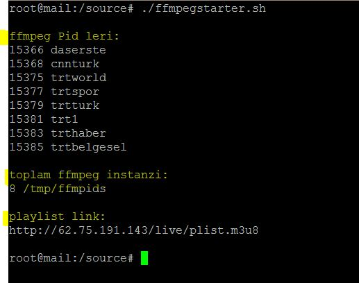
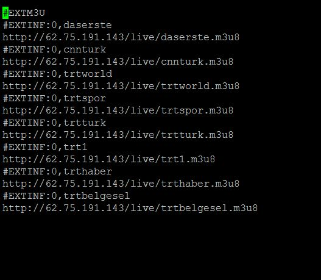

# ffmpegBackgroundService

Das script ermöglich ffmpeg instanzen als Hintergrunddienst zu starten, die vorher über ein festgelegte array Links einliest und daraus restream auf dem server startet und dazu eine playlist aus der kompletten Streams erstellt.

Zu guter letzt wird die Ausgabe von pid zu den jeweiligen ffmpeg instanz ausgegeben und in ein logdatei gespeichert.

Jede ffmpeg verfügt über seine eigene logausgabe in Datei.

voraussetzung
- webserver muss installiert sein nginx oder ähnliches
- ffmpeg muss installiert sein

Aysad Kozanoglu | email: aysadx@gmail.com | http://onweb.pe.hu

The MIT License (MIT)

Copyright (c) <2016> <copyright Aysad Kozanoglu>

Permission is hereby granted, free of charge, to any person obtaining a copy of this software and associated documentation files (the "Software"), to deal in the Software without restriction, including without limitation the rights to use, copy, modify, merge, publish, distribute, sublicense, and/or sell copies of the Software, and to permit persons to whom the Software is furnished to do so, subject to the following conditions:

The above copyright notice and this permission notice shall be included in all copies or substantial portions of the Software.

THE SOFTWARE IS PROVIDED "AS IS", WITHOUT WARRANTY OF ANY KIND, EXPRESS OR IMPLIED, INCLUDING BUT NOT LIMITED TO THE WARRANTIES OF MERCHANTABILITY, FITNESS FOR A PARTICULAR PURPOSE AND NONINFRINGEMENT. IN NO EVENT SHALL THE AUTHORS OR COPYRIGHT HOLDERS BE LIABLE FOR ANY CLAIM, DAMAGES OR OTHER LIABILITY, WHETHER IN AN ACTION OF CONTRACT, TORT OR OTHERWISE, ARISING FROM, OUT OF OR IN CONNECTION WITH THE SOFTWARE OR THE USE OR OTHER DEALINGS IN THE SOFTWARE.
