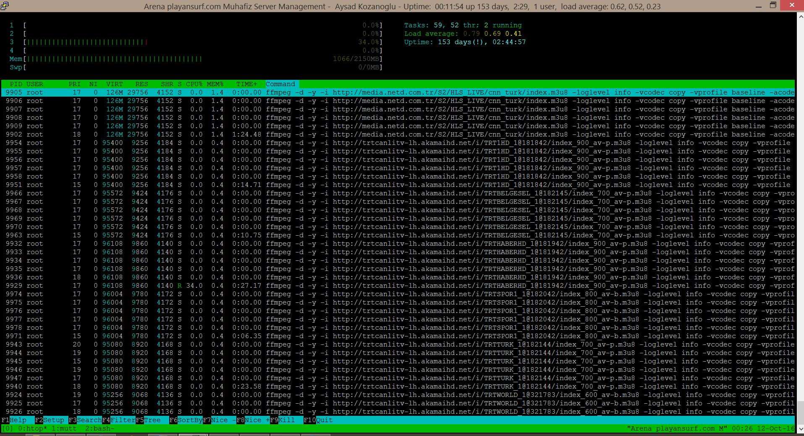

# ffmpegBackgroundService

Das script ermöglich ffmpeg instanzen als Hintergrunddienst zu starten, die vorher über ein festgelegte array Links einliest und daraus restream auf dem server startet und dazu eine playlist aus der kompletten Streams erstellt.

Zu guter letzt wird die Ausgabe von pid zu den jeweiligen ffmpeg instanz ausgegeben und in ein logdatei gespeichert.

Jede ffmpeg verfügt über seine eigene logausgabe in Datei.

voraussetzung
- webserver muss installiert sein nginx oder ähnliches
- ffmpeg muss installiert sein

